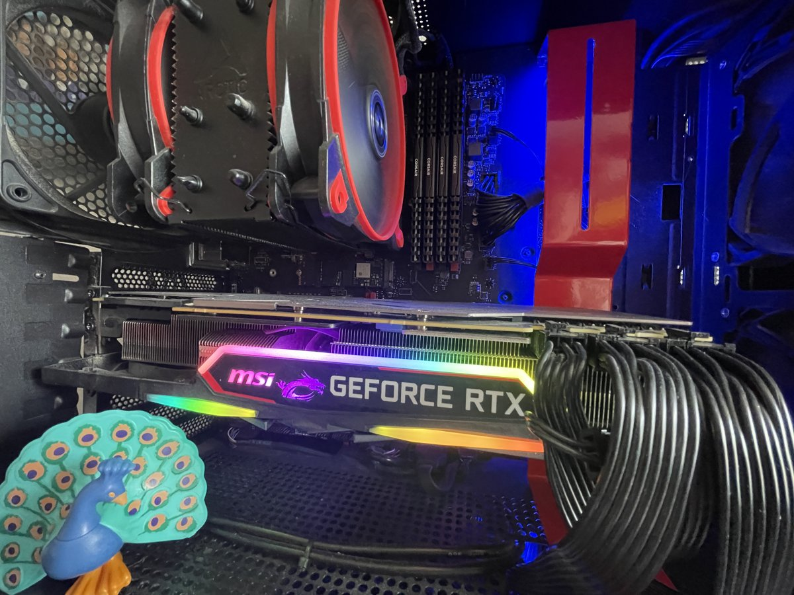
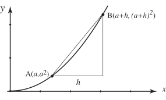
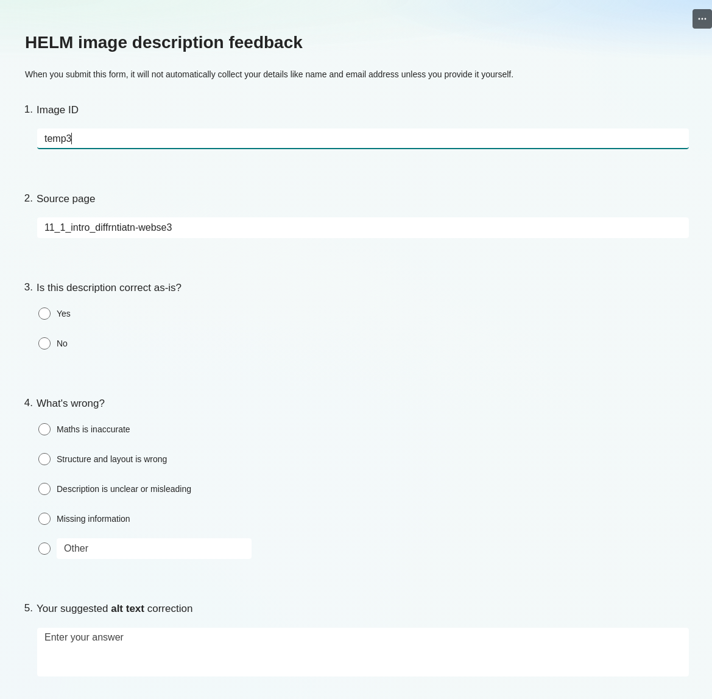

## The Problem {background-color="#065A82"}

:::::: {.columns}

:::: {.column width="58%"}

### Universities have a **legal obligation** to make online content accessible

- **Public Sector Bodies Accessibility Regulations 2018** require all HE website content to meet **WCAG 2.1 AA**
- Reinforced by the **Equality Act 2010**, which requires reasonable adjustments to digital content
- Most HE providers are in scope due to dependence on public funding
- This includes learning materials — not just institutional websites

::: {.fragment}
> "Almost all internal and external content and systems accessed through a browser fall within scope."
> — [Jisc](https://www.jisc.ac.uk/guides/practical-steps-to-meeting-accessibility-regulations)
:::

::::

:::: {.column width="42%"}

### The scale of the challenge

```
HELM: Helping Engineers Learn Mathematics
──────────────────────────────────────────
50 workbooks
500+ HTML pages
924 diagrams & graphs
```

::: {.fragment}
**Zero long descriptions** in the original resource.

Each image needs **alt text** *and* a **long description** — and manual authoring at this scale is simply not feasible.
:::

::::

::::::

---

## What is HELM? 

:::::: {.columns}

:::: {.column width="55%"}

**Helping Engineers Learn Mathematics**

- Originally created by [the HELM consortium](https://www.lboro.ac.uk/departments/mlsc/student-resources/helm-workbooks/)
- Converted to accessible HTML by [MASH at the University of Bath](https://www.bath.ac.uk/professional-services/mathematics-resources-centre-mash/), supported by the [sigma Network](http://www.sigma-network.ac.uk/)
- Released under a Creative Commons (BY-NC) licence
- Covers everything from Basic Algebra to Advanced Statistics

::::

:::: {.column width="45%"}

{fig-alt="HELM logo" width="60%"}

{fig-alt="sigma Network logo" width="60%"}

::::

::::::

::: {.fragment}
🔗 [bathmash.github.io/HELM](https://bathmash.github.io/HELM/)
:::

---

## Why Run AI Locally? 

:::::: {.columns}

:::: {.column width="45%"}

### The university AI tools weren't an option

- IT policy gives **no command-line or API access** to university AI services
- Commercial APIs (OpenAI, Gemini) are available — but the cost was difficult to predict

::: {.callout-warning}
## How many tokens is a maths diagram?
To be honest - I have no idea!
:::

::::

:::: {.column width="55%"}

### The local solution

- **Ollama** — run open-source LLMs locally, no API key needed
- **gemma4** — Google's multimodal model, understands mathematical diagrams

{fig-alt="A consumer graphics card (GPU) sitting on a desk, used to run the gemma4 language model locally via Ollama" width="75%"}

::::

::::::

---

## Guided by Expertise: The DIAGRAM Centre

:::::: {.columns}

:::: {.column width="60%"}

The LLM prompt was structured around guidelines from the **DIAGRAM Centre's POET tool**

### Key principles used:

- **Context first** — what type of image is this?
- **Audience awareness** — engineering students need precision
- **Two-tier output** — short alt text *and* long description
- **Maths-specific conventions** — axes, units, trends, data tables
- **LaTeX throughout** — all maths in `\( \)` notation

::::

:::: {.column width="40%"}

::: {.callout-tip}
## POET guidelines cover:

- Graphs & charts
- Geometric figures
- Flow charts
- Complex diagrams
- Mathematical notation
:::

🔗 [poet.bornaccessible.org](https://poet.bornaccessible.org/how.html#mathematics)

::::

::::::

---

## The Script: Prompting the Model 

Getting reliable, structured output from an LLM requires careful use of **system prompts, user prompts, and JSON mode** together:

:::::: {.columns}

:::: {.column width="50%"}

**System prompt** sets the persona and hard rules — things the model must always do, regardless of the image:

```python
{"role": "system", "content": """
You are an assistant producing structured
accessibility descriptions.

- Output must be valid JSON
- Always use LaTeX: \\( and \\)
- long_description must be a bulleted list
- Describe only what is visible
- Spell out all abbreviated units
"""}
```

::::

:::: {.column width="50%"}

**User prompt** passes the image and its HTML context — so the model knows whether a graph is illustrating integration or signal processing:

```python
{"role": "user",
 "content": f"Describe the image.\nContext: {context}",
 "images": [png_path]}
```

**JSON mode** enforces the output structure — no freeform text, no markdown fences, no refusals:

```python
format={
  "type": "object",
  "properties": {
    "alt":              {"type": "string"},
    "long_description": {"type": "string"}
  },
  "required": ["alt", "long_description"]
}
```

::::

::::::

---

## The Script: SVG → PNG → HTML {background-color="#ffffff"}

:::::: {.columns}

:::: {.column width="50%"}

**1. Convert SVG to PNG**

HELM images are **SVG** — great for accessible interaction, but multimodal LLMs require raster input. The script auto-converts using Inkscape (falling back to ImageMagick):

```python
def convert_svg_to_png(svg_path, output_png):
    subprocess.run(
      f"inkscape --export-type=png "
      f"--export-filename={output_png} "
      f"{svg_path}", shell=True
    )
```

The original SVG stays in the HTML — only PNG goes to the model.

::: {.callout-note}
## Why SVG → PNG?

HELM images are **SVG** — which supports accessible interaction (zoom, reflow, screen reader structure).

But multimodal LLMs need **raster images**. The script converts each SVG to PNG on the fly for the model, while keeping the original SVG in the HTML for users.
:::

::::

:::: {.column width="50%"}

**2. Write descriptions back into HTML**

Alt text is written directly onto the `` tag. A separate long-description page is created and linked:

```python
img['alt'] = result['alt']

page_path = make_longdesc_page(
    html_file, img_basename,
    long_description, png_path, alt
)
# Insert link after the image
a = soup.new_tag('a', href=href)
a.string = 'Long description'
img.parent.insert_after(a)
```

::::

::::::

---

## The Script: Fixing the Output {background-color="#ffffff"}

**Fix the output programmatically, not by prompting**

It is more reliable — and kinder to the model's context window — to repair predictable LLM output errors in Python rather than asking the model to self-correct.

:::::: {.columns}

:::: {.column width="50%"}


**LaTeX escape repair** — `json.loads()` silently converts `\t`, `\f`, `\r` to control characters, mangling common LaTeX commands:

```python
repairs = [
    ('\frac',  r'\frac'),
    ('\theta', r'\theta'),
    ('\text',  r'\text'),
    ('\times', r'\times'), ...
]
```

::::

:::: {.column width="50%"}


**Bullet-point → HTML conversion** — the model returns `*`-delimited bullets; the script converts them to a proper `<ul>` list:

```python
def bullets_to_html(text):
    items = re.split(r'\s*\*\s*', text)
    return '<ul>\n' + ''.join(
        f'  <li>{i}</li>\n'
        for i in items if i.strip()
    ) + '</ul>'
```

::::

::::::

---

## Example Output {background-color="#ffffff"}

:::::: {.columns}

:::: {.column width="38%"}

### Input image

{fig-alt="A graph showing a curve and a secant line segment forming a right triangle, illustrating a concept related to derivatives." width="100%"}

**Alt text generated:**

> A graph showing a curve and a secant line segment forming a right triangle, illustrating a concept related to derivatives.

::::

:::: {.column width="62%"}

**Long description generated** *(as shown on the linked description page):*

- A two-dimensional Cartesian coordinate system; horizontal axis labelled $x$, vertical axis labelled $y$
- A curve passes through two marked points: $A(a,\, a^2)$ and $B(a+h,\, (a+h)^2)$
- A horizontal distance $h$ is indicated on the $x$-axis between the $x$-coordinates of the two points, forming the base of a triangle
- A vertical line segment connects the $y$-coordinate of $A$ to the $y$-coordinate of $B$
- A right-angled triangle is formed by the secant $AB$ (hypotenuse), the horizontal distance $h$, and the vertical distance between the projected $y$-values

::: {.fragment}
::: {.callout-warning appearance="minimal"}
⚠️ **This description was generated by AI and has not been verified by a human.** If you spot an error, please use the feedback link.
:::
:::

::::

::::::

---

## The Human-in-the-Loop System {background-color="#028090"}

:::::: {.columns}

:::: {.column width="55%"}

### AI is fast — humans ensure accuracy

The generated descriptions are a starting point, not a final product.

Each long-description page carries a clear notice:

> *"This description was generated by AI and has not been verified by a human."*

**Anyone can feed back via a Microsoft Form linked on every page:**

1. View the image alongside its generated description
2. ✅ **Confirm** it is accurate
3. ✏️ **Suggest an alternative** if the description is wrong or incomplete

::::

:::: {.column width="45%"}

{fig-alt="Screenshot of the Microsoft Forms feedback form, which allows users to confirm the accuracy of the AI-generated description or suggest improvements." width="100%"}

::::

::::::

---

## We Need Your Contributions! 

::: {.r-fit-text}
**Help us verify 924 descriptions**
:::

:::::: {.columns}

:::: {.column width="60%"}

You don't need to code — just:

- Browse the HELM workbooks
- Find an image with a long description link
- Tell us if it's right, or suggest something better

**Especially valuable from:**

- Maths content experts (is the description mathematically precise?)
- Accessibility specialists (does it follow best practice?)
- Screen reader users (is it actually useful?)

::::

:::: {.column width="40%"}

::: {.callout-important}
## How to contribute

Browse the resource:  
**[bathmash.github.io/HELM](https://bathmash.github.io/HELM/)**

Or contact Ed directly:  
**[edrs20@bath.ac.uk](mailto:edrs20@bath.ac.uk)**
:::

::::

::::::

---

## The Technical Stack {background-color="#ffffff"}

:::::: {.columns}

:::: {.column width="55%"}

| Component | Tool |
|-----------|------|
| LLM runtime | [Ollama](https://ollama.com) |
| Model | gemma4:e4b (multimodal) |
| Image format | SVG → PNG (Inkscape / ImageMagick) |
| Scripting | Python + BeautifulSoup |
| Description guidelines | DIAGRAM Centre / POET |
| Structured output | Ollama JSON mode |
| Feedback | Microsoft Forms (per page) |
| Resource | HELM  |

::::

:::: {.column width="45%"}


### Everything is free

🆓 Ollama · gemma4 · Python · HELM

### Links

- **HELM workbooks:** [bathmash.github.io/HELM](https://bathmash.github.io/HELM/)
- **POET description guidelines:** [poet.bornaccessible.org](https://poet.bornaccessible.org/how.html#mathematics)
- **sigma Network:** [sigma-network.ac.uk](http://www.sigma-network.ac.uk/)


::::

::::::

